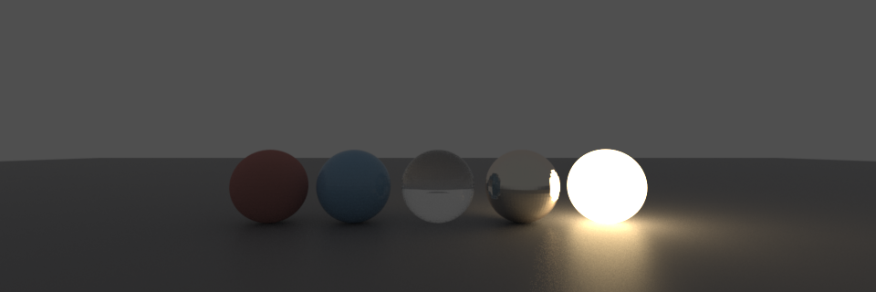
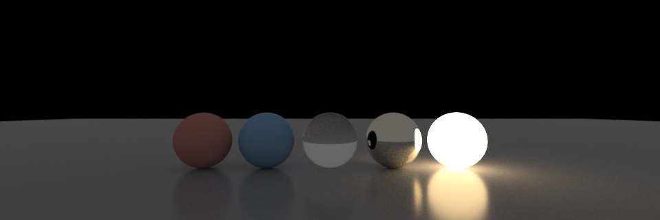

# `nsi-moonray`

An [ɴsɪ](https://nsi.readthedocs.io/) backend for
[MoonRay](https://github.com/OpenMoonRay/moonray), DreamWorks
Animation's production renderer.

**Status: it renders, in process.** A recorded ɴsɪ scene builds
straight into a live `scene_rdl2` `SceneContext` and renders in a
`RenderContext`, in the calling process. No scene file, no spawned
binary. Pixels come back as they converge, to the closures an ɴsɪ app
hands its output driver. Edit the scene between frames, only the edit
gets re-sent.

`.rdla` (MoonRay's ASCII format) is still written on request -- `mnry
cat`, a bug report, an oracle diff -- but it's a dump, not the
transport. Captured from `scene_rdl2`'s own `AsciiWriter`, not
guessed at; rdl2 reads it back. See
[`specs/001-moonray-backend/oracle/`](specs/001-moonray-backend/oracle/).

What crosses: polygon meshes and subdivision surfaces (creases,
corners), instancing (native both sides, nested, blurred), transform
and deformation motion blur on one scene-wide shutter, cameras
(perspective, orthographic, fisheye, spherical), render outputs
including built-in/primvar/per-lobe AOVs, OpenVDB volumes, `st`/`N`/
arbitrary primvars in any ɴsɪ interpolation, and lights -- which in
ɴsɪ are just geometry wearing an emissive shader.

Shading runs OSL. ɴsɪ *is* OSL -- a `shader` node names a compiled
`.oso` -- so the network crosses as an OSL group specification and
MoonRay runs it, through `Osl`, `OslDisplacement`, `OslMap` and
`OslVolume` in [`dso/osl/`](dso/osl/). Needs OSL at build time; `just
setup` gets it.

Without OSL, every shader becomes a `UsdPreviewSurface` instead,
carrying whatever parameters it's known to have. Known shaders are a
table read off 3Delight's own `.oso` files, not typed from memory;
anything else is reported by name. Displacement has no substitute at
all.

## Why OSL, not a name table

ɴsɪ has no light nodes. A light is geometry whose surface shader
produces an `emission()` closure -- one surface can emit and reflect
at once. A renderer that recognises lights by shader *name* can't do
that: it infers a type, throws the shader away, and the object is a
light *or* a surface.

This backend runs the shader instead. Every emitter becomes a MoonRay
`MeshLight`, lit by an `OslMap` running the real network -- colour and
intensity come from the closure, sampled per point, not a name lookup.
The name table above is only a fallback, for no-OSL builds or a shader
with no compiled `.oso` behind it.

Two gaps remain:

- **`environment` shaders don't run.** `EnvLight` is a light class,
  not a shader. Colour, intensity, exposure and a texture path cross;
  gradients and mappings don't. (3Delight's own `environmentLight`
  defaults `i_color` to 0.5 grey and applies it -- reading only
  intensity here would give a white dome a full stop too bright, so
  unset values are read from the compiled shader's declarations
  instead of rdl2's.)
- **A shader that both emits and shades has no faithful mapping.**
  MoonRay won't put a `MeshLight`'s geometry in the render layer too,
  so one mesh is shaded *or* a light, never both. Kept as a surface;
  its emission goes hit-only.

Everything else -- surfaces, displacement, volumes, emissive geometry
-- crosses and runs as OSL. Nothing built-in ever substitutes for a
shader the scene named.

## One scene, two renderers

`tests/shaderballs.rs` builds a row of five spheres -- matte, plastic,
glass, metal, emissive -- once, through `nsi::Context`, and renders it
twice. Same shader, `dlPrincipled`, five parameter sets. The passes
differ by one string:

```rust
nsi::Context::new(Some(&[nsi::string!("renderer", "3delight")]));
nsi::Context::new(Some(&[nsi::string!("renderer", "moonray")]));
```

**3Delight**



**MoonRay, through this crate**



Both run OSL end to end; the environment is the one thing MoonRay has
no shader path for, so it's named directly through the stub in
[`shaders/`](shaders/), and the two skies measure identical.

Two disagreements left: glass renders opaque (no transmission lobe
yet in this closure walk), and the emitter lights less than it should
(same emit-and-shade limit as above -- MoonRay's self-emission is
hit-only). Matte and plastic agree closely, MoonRay about a third of
a stop brighter.

## `mnry`

```bash
mnry render scene.nsi                 # in process, if built with `rdl2`
mnry render 'shot.@4.nsi' -f 1-48     # a frame sequence
mnry cat scene.nsi -l                 # what MoonRay would be given
mnry watch /spool -r                  # render what lands there
```

Modelled on [`rdl`](https://github.com/virtualritz/delight-helpers),
the `renderdl` replacement: same subcommands and frame-sequence syntax,
but parses ɴsɪ streams into `nsi-intermediate` and builds MoonRay's
scene directly instead of going through 3Delight's C API.

Scene classes load from MoonRay's `rdl2dso` directory: beside the
running binary first, then the platform default
(`~/.local/share/moonray` on Linux, `~/Library/Application
Support/MoonRay` on macOS, `%LOCALAPPDATA%\MoonRay` on Windows).
`--dso-path` / `$NSI_MOONRAY_DSO` overrides that: a path that isn't
there fails, rather than falling back to some other install.

Built without `rdl2` (the default), `mnry render` writes the scene and
spawns the `moonray` binary instead, which renders the same image, just
later. `-v` says which path it took.

## The demo

`examples/polyhedron` builds a polyhedron with
[`polyhedron-ops`](https://github.com/virtualritz/polyhedron-ops) and
renders it with MoonRay. Nothing in it names MoonRay beyond the string
-- the `nsi` crate resolves a renderer at run time.

## As a drop-in renderer

Also builds as `libnsi_moonray.so`, exporting the same ɴsɪ C entry
points 3Delight does -- loadable wherever 3Delight is. The
[`nsi`](https://github.com/virtualritz/nsi) crate picks a renderer by
name at run time:

```rust
let context = nsi::Context::new(Some(&[
    nsi::string!("renderer", "moonray"),
]));
```

`$NSI_MOONRAY` is where a host looks for this backend (same idea as
`$DELIGHT`); `$NSI_RENDERER` picks the default when no argument is
given. Not `$MOONRAY_ROOT` -- that's DreamWorks' renderer itself, and
the two get installed separately often enough that one variable for
both would be ambiguous.

Taking a `.rdla` dump to the stock `moonray` binary needs
`-exec_mode scalar` -- OSL shades one point at a time, and MoonRay's
default vectorized mode silently skips what it can't call. The linked
and spawned paths here force this flag themselves.

## Installing

```bash
just pixi-install   # dependencies, into .pixi/, no root
just install        # MoonRay, then mnry linked against it
```

Defaults to the platform's per-user data directory; `just install
/opt/moonray` puts it elsewhere. Builds a renderer only if that place
has none (about an hour), then `cargo install`s `mnry` with the
renderer feature on. Offers to add `PREFIX/bin` to your shell profile
afterwards -- asks, takes silence for no.

Plain `cargo install --path .` also works, gives you the emitter
(`mnry cat`, `.nsi` to `.rdla`) with `mnry render` falling back to the
spawned `moonray` binary.

For distribution: `just bundle` (relocatable tree), `just package`
(`.deb`/AppImage/`.dmg`). **Windows gets no renderer** -- MoonRay's
CMake has no MSVC path, so a Windows package would ship the emitter
with nothing to render with.

## Building

```bash
git clone https://github.com/virtualritz/nsi-moonray.git
cd nsi-moonray && just ci
```

`just --list` has the rest. Builds and tests the emitter, the flush
and the oracle -- everything except linking a renderer.

Handles are interned by default (`interned_handles`). On a
100,001-node scene: 244.8 MB / 32.6 s without it, 174.3 MB / 11.7 s
with. `default-features = false` turns it, and `mnry`, off.

### With a renderer

```bash
just setup       # dependencies, then MoonRay into the default prefix
just test-rdl2   # the tests that link it and render
```

Roughly an hour, nearly all of it MoonRay. `just renderer-check`
checks tools and headers before anything's cloned.

```bash
cargo binstall --git https://github.com/prefix-dev/pixi pixi
```

`--git`, not the plain crate name -- crates.io's pixi is two years
stale. Dependencies come from [pixi](https://pixi.sh) because Open
Shading Language isn't packaged by Ubuntu or Homebrew; the [ASWF
channel](https://github.com/anderslanglands/aswf-pixi) has it. `just
deps` is the system-package route instead, and has no OSL.

MoonRay is cloned, not a submodule -- four repos, several hundred
megabytes, useless to anyone who just wants the emitter, which is why
`rdl2` is off by default.

## Why MoonRay

Apache-2.0, actively developed, its scene model maps onto ɴsɪ closely:

| ɴsɪ | `scene_rdl2` |
| --- | --- |
| node with a handle | `SceneObject` |
| node type | `SceneClass`, with declared typed attributes |
| shader connection with named ports | attribute **bindings**, ports carried natively |
| `attributes` node | `Layer`, a real assignment table |
| `.nsi` stream | `.rdla` / `.rdlb` |
| motion samples | `blur(a, b)` on an attribute |

And it does things the Mitsuba backend can't: real motion blur
(Mitsuba 3 dropped `AnimatedTransform`), analytic primitives that stay
analytic on Embree, limit-surface subdivision with adaptive
tessellation, progressive rendering. Cited in
`specs/001-moonray-backend/research.md`.

## Limitations

Permanent -- the gap's in MoonRay's own control surface, not how much
of it is wired up. Every row below is a live
`flushed.limitations.push(...)` site or a documented gap in
`upstream/`, not a guess.

One thing that isn't a loss: a geometry ɴsɪ connects under several
transforms with different materials is one shared object in the
interface, and `RdlMeshGeometry` can't do that natively -- so this
backend expands it into one object per placement at the translator
boundary, and it's tested: nothing is dropped, only duplicated
internally.

What follows is dropped:

| Area | ɴsɪ can express | On this backend |
| --- | --- | --- |
| Caustics | `caustics.cast`/`.receive`/`.emit`, `quality.causticsamples` | MoonRay's "caustic" is an eye-caustic BSDF lobe, not a photon-density control. Reported as unread, ignored. |
| Holdouts | `matte` | No counterpart. Renders as ordinary geometry. |
| Mesh lights | A `MeshLight`'s geometry also carrying a material | `RenderContext::createMeshLightLayer` warns and skips a light whose geometry is in the main render `Layer`, so it can't wear a material -- kept out of the `Layer`, forced visible in camera instead. (Also kept *in* the `GeometrySet`, defensively: geometry in neither, given a `map_shader`, segfaults at render prep -- `upstream/moonray-meshlight-map-shader-segfault.md`.) |
| OSL execution mode | Any OSL shading | Needs `-exec_mode scalar`; MoonRay's vectorized default silently skips what it can't call. Forced when this backend runs MoonRay itself; a raw `.rdla` dump needs it set by hand. |
| Environment shading | `environment`'s full OSL network, and `angle` restricting it to a cone (ɴsɪ's way of spelling a sun) | Only colour/intensity/exposure/texture cross; see above. `angle` has no `EnvLight` equivalent at all -- a sun renders as a full sky. |
| Emissive surfaces | A shader that emits and shades | Kept a surface; emission is hit-only. |
| Render globals | `.global` attributes with no `GLOBALS` row | Reported, ignored; MoonRay's own defaults apply. |
| Motion samples | More than two | `scene_rdl2` has exactly two timesteps; the rest are resampled onto the shutter's ends. |
| Instancer blur | Rotation/scale across the shutter | Only translation blurs. |
| Cryptomatte | `id.geometry`, `id.scenepath`, `id.surfaceshader` as distinct outputs | One MoonRay output for all three, and it isn't even an intrinsic object id: it reads whatever float primitive attribute is named in `SceneVariables.deep_id_attribute_names`, defaulting to `0.0` for everything if that's unset. |
| Curve basis | `catmull-rom`, `hobby`, `extrapolate` | `linear` and `b-spline` cross and render correctly; `catmull-rom`/`hobby` have no MoonRay counterpart and fall back to linear; `extrapolate` has none either. |
| Cameras | `cylindricalcamera` | No equivalent; camera is skipped. (Every ɴsɪ fisheye `mapping` -- `equidistant`, `equisolidangle`, `orthographic`, `stereographic` -- has a MoonRay counterpart and crosses correctly.) |
| Particles | `N` for orientation | Renders as spheres regardless. |
| Volumes | Scalar OpenVDB emission grid | `VdbGeometry` reads RGB emission only. |

## Architecture

This repository owns only the flush. Recording, connection
classification and graph resolution happen upstream, in
[`nsi-intermediate`](https://github.com/virtualritz/nsi), shared with
[`nsi-mitsuba`](https://github.com/virtualritz/nsi-mitsuba).

```
ɴsɪ calls -> nsi-intermediate -> nsi-moonray -> scene_rdl2 -> MoonRay
                             \
                              -> nsi-mitsuba -> Properties -> Mitsuba 3
```

```rust
use nsi_intermediate as nsi_ir; // consumers may alias the dependency
```

## Documentation

Spec-driven; see [`specs/`](specs/). Shared standards come from
`.blueprints`, a private submodule -- plain `git clone` works, only
`--recurse-submodules` fails on that path.

## Licence

MIT OR Apache-2.0 OR Zlib.
